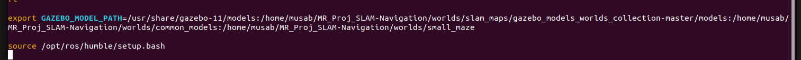

# How to use
Build: `colcon build --symlink-install`  
Source: `source install/setup.bash`  
Run: `ros2 launch differential_drive_robot robot.launch.py`

## Setup worlds
You can change worlds by changing world index in `robot.launch.py` worlds list. Worlds are: Office, Construction, Maze  
For setup, add the following line into `~/.bashrc` just before sourcing ros:
`export GAZEBO_MODEL_PATH=/usr/share/gazebo-11/models:/home/musab/MR_Proj_SLAM-Navigation/worlds/slam_maps/gazebo_models_worlds_collection-master/models:/home/musab/MR_Proj_SLAM-Navigation/worlds/common_models:/home/musab/MR_Proj_SLAM-Navigation/worlds/small_maze`  
Some of the paths above will be modified for your machine, (up till the part where it says /home/musab/  from thereon it should stay same)

## Setup navigation
Install slam toolbox, navigation2 and nav2_bringup for ros-humble

Here's a photo of the end of my bashrc file for reference:

